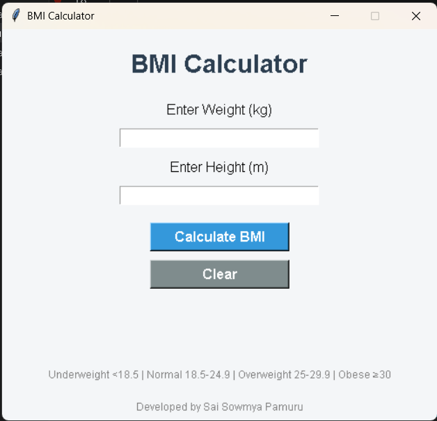
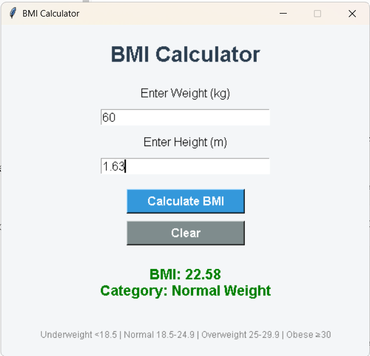

# BMI Calculator

## Project Overview

BMI Calculator is a Python-based GUI application developed using Tkinter. The application allows users to calculate their Body Mass Index (BMI) by entering their weight and height. Based on the calculated BMI value, the application categorizes the user into different health categories.

## Features

- User-friendly graphical interface
- BMI calculation using the standard BMI formula
- BMI category classification
- Input validation
- Error handling for invalid inputs
- Clear button to reset input fields
- Color-coded BMI results

## Technologies Used

- Python
- Tkinter

## BMI Formula

BMI = Weight (kg) / Height² (m²)

## BMI Categories

| BMI Range | Category |
|------------|------------|
| Below 18.5 | Underweight |
| 18.5 – 24.9 | Normal Weight |
| 25 – 29.9 | Overweight |
| 30 and Above | Obese |

## How to Run the Project

1. Open the project folder in VS Code.
2. Open the terminal.
3. Run the following command:

```bash
python bmi_calculator.py
```

4. Enter weight in kilograms.
5. Enter height in meters.
6. Click **Calculate BMI** to view the result.

## Screenshots

### Home Screen



### Result Screen



## Learning Outcomes

Through this project, I learned:

- GUI development using Tkinter
- User input handling
- Input validation
- Conditional statements in Python
- Error handling using message boxes
- Building interactive desktop applications

## Developed By

**Sai Sowmya Pamuru**

Python Programming Internship Project – Oasis Infobyte