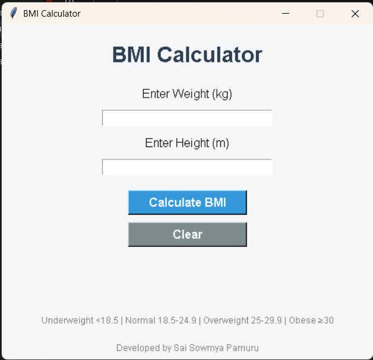
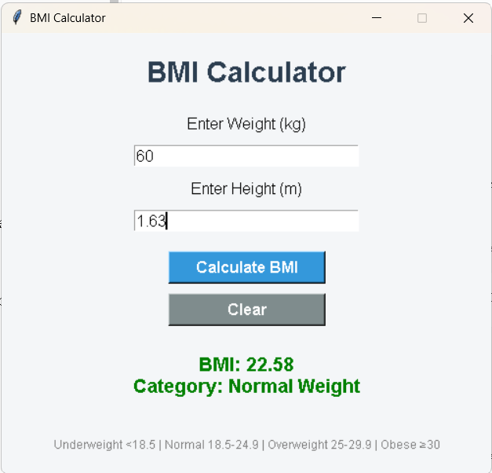
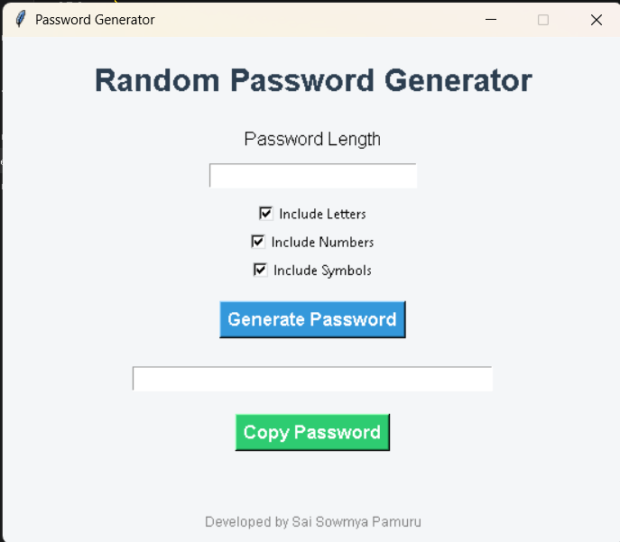
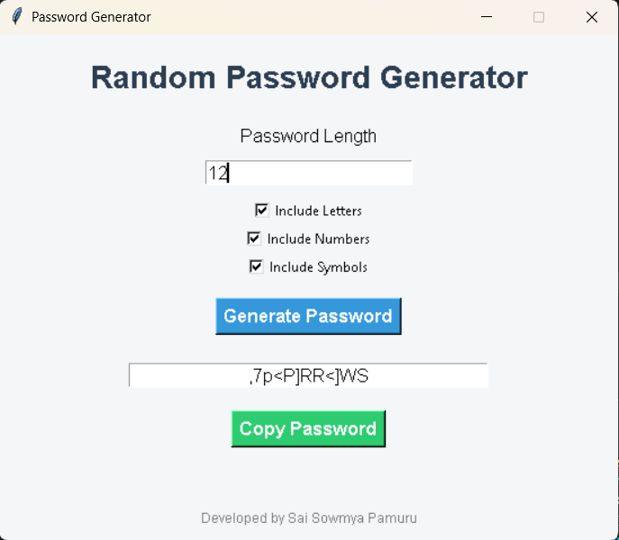
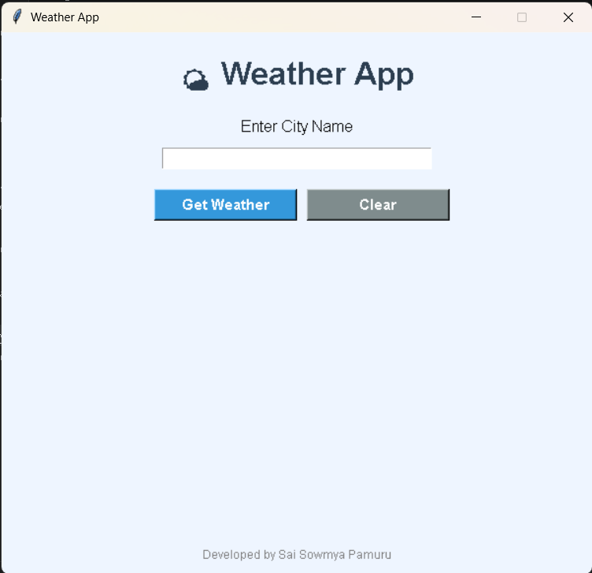
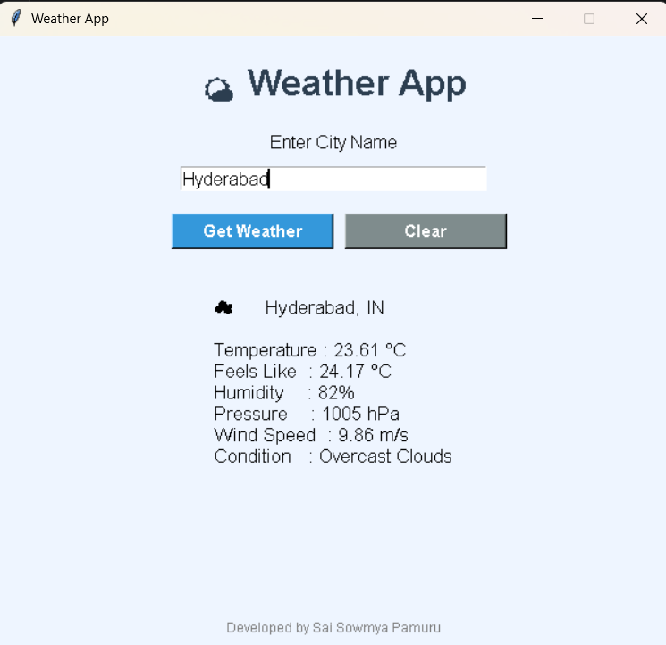

# Oasis Infobyte Python Programming Internship

Welcome to my **Python Programming Internship** repository developed as part of the **Oasis Infobyte Internship Program**.

This repository contains all the Python projects completed during my internship.

---

# Developer

**Name:** Sai Sowmya Pamuru

---

# Internship Details

- **Organization:** Oasis Infobyte
- **Domain:** Python Programming
- **Language:** Python
- **IDE:** Visual Studio Code

---

# Projects

## Task 1 - BMI Calculator

### Project Overview

The BMI Calculator is a GUI-based application developed using Python and Tkinter. It calculates the user's Body Mass Index (BMI) based on height and weight and displays the corresponding health category.

### Features

- User-friendly GUI
- BMI Calculation
- Health Category Classification
- Input Validation
- Clear Button
- Attractive Interface

### Technologies Used

- Python
- Tkinter

### Screenshots

#### Home Screen



#### Result Screen



---

## Task 2 - Random Password Generator

### Project Overview

The Random Password Generator is a GUI-based application that generates secure passwords according to the user's selected password length and character preferences.

### Features

- Random Password Generation
- Custom Password Length
- Letters, Numbers & Symbols
- Copy Password to Clipboard
- User-friendly GUI

### Technologies Used

- Python
- Tkinter
- Random
- String

### Screenshots

#### Home Screen



#### Result Screen



---

## Task 3 - Weather App

### Project Overview

The Weather App is a GUI-based Python application that fetches real-time weather information using the OpenWeatherMap API. Users can search for any city to view current weather details.

### Features

- Search Weather by City
- Live Temperature
- Feels Like Temperature
- Humidity
- Pressure
- Wind Speed
- Weather Condition
- Error Handling
- Attractive GUI

### Technologies Used

- Python
- Tkinter
- Requests
- OpenWeatherMap API

### Screenshots

#### Home Screen



#### Result Screen



---

## Task 4 - Voice Assistant

### Project Overview

The Voice Assistant is a simple Python application that recognizes voice commands and responds using speech synthesis. It can greet the user, tell the current time and date, and respond to basic voice commands.

### Features

- Voice Recognition
- Text-to-Speech
- Greeting Commands
- Current Time
- Current Date
- Basic Voice Interaction

### Technologies Used

- Python
- SpeechRecognition
- pyttsx3
- Datetime

### Screenshot


---

# Technologies Used

- Python
- Tkinter
- Requests
- Random
- String
- SpeechRecognition
- pyttsx3
- Datetime

---

# Repository Structure

```text
OIBSIP
│
├── README.md
│
├── SaiSowmyaPamuru_Task1_BMI_Calculator
│   ├── bmi_calculator.py
│   ├── README.md
│   └── Screenshots
│
├── SaiSowmyaPamuru_Task2_Password_Generator
│   ├── password_generator.py
│   ├── README.md
│   └── Screenshots
│
├── SaiSowmyaPamuru_Task3_Weather_App
│   ├── weather_app.py
│   ├── README.md
│   └── Screenshots
│
└── SaiSowmyaPamuru_Task4_Voice_Assistant
    ├── voice_assistant.py
    ├── README.md
    └── Screenshots
```

---

# Learning Outcomes

During this internship, I gained hands-on experience in:

- Python Programming
- GUI Development using Tkinter
- API Integration
- Password Generation
- Voice Recognition
- Weather Data Retrieval
- User Input Validation
- Error Handling
- Git & GitHub
- Project Documentation

---

# Acknowledgement

I sincerely thank **Oasis Infobyte** for providing me with the opportunity to enhance my Python programming skills through practical, project-based learning.

---

# Thank You

Thank you for visiting this repository.

If you found this repository helpful, please consider giving it a ⭐ on GitHub.
