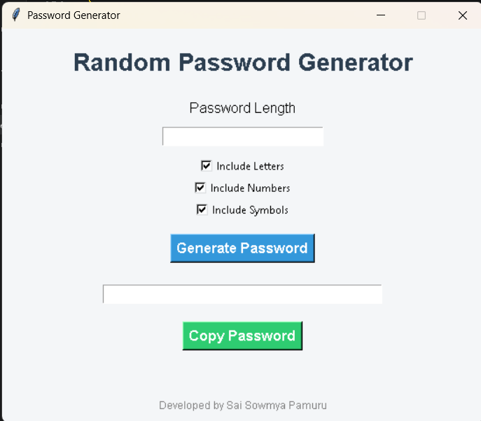
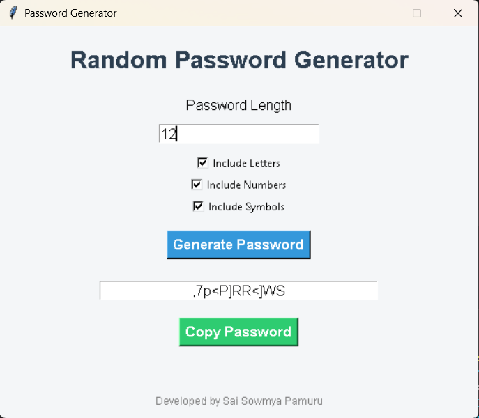

# Random Password Generator

## Project Overview

Random Password Generator is a Python-based GUI application developed using Tkinter. The application allows users to generate secure and random passwords by selecting the desired password length and character types such as letters, numbers, and symbols.

## Features

- User-friendly graphical interface
- Generate random passwords instantly
- Custom password length selection
- Option to include:
  - Letters
  - Numbers
  - Symbols
- Copy generated password to clipboard
- Input validation and error handling

## Technologies Used

- Python
- Tkinter
- Random Module
- String Module

## How It Works

1. Enter the desired password length.
2. Select the character types to include.
3. Click **Generate Password**.
4. The application generates a random password.
5. Click **Copy Password** to copy it to the clipboard.

## Project Structure

```text
Task2_Password_Generator
│
├── password_generator.py
├── README.md
│
└── screenshots
    ├── home_screen.png
    └── result_screen.png
```

## Screenshots

### Home Screen



### Generated Password



## Learning Outcomes

Through this project, I learned:

- GUI development using Tkinter
- Random password generation
- Character set handling
- User input validation
- Clipboard operations
- Python modules such as random and string

## Future Enhancements

- Password strength indicator
- Dark mode support
- Save generated passwords to a file
- Custom character exclusion options

## Developed By

**Sai Sowmya Pamuru**

Python Programming Internship Project – Oasis Infobyte