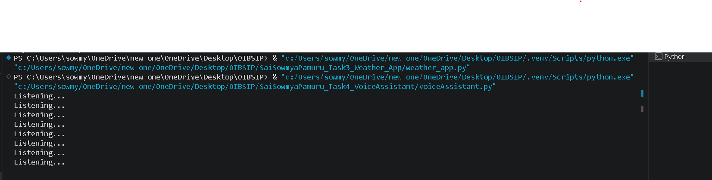

# Voice Assistant

## Project Overview

Voice Assistant is a simple Python-based application that recognizes voice commands and responds using speech synthesis. It can greet the user, tell the current time and date, and respond to basic voice commands.

---

## Features

-  Voice Recognition
-  Text-to-Speech Response
-  Greeting Commands
-  Current Time
-  Current Date
-  Exit Command

---

## Technologies Used

- Python
- SpeechRecognition
- pyttsx3
- Datetime

---

## Project Structure

```
SaiSowmyaPamuru_Task4_Voice_Assistant
│
├── voice_assistant.py
├── README.md
└── screenshots
    └── output_screen.png
```

---

## Screenshot



---

## How to Run

Install the required libraries

```bash
pip install SpeechRecognition
pip install pyttsx3
pip install pyaudio
```

Run the application

```bash
python voice_assistant.py
```

---

## 👩‍💻 Developed By

**Sai Sowmya Pamuru**
